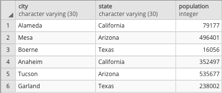
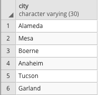

## Creating Tables

In this activity, you will use MySQL to recreate and query a table based on image provided to you.

### Instructions

1. Create a new database in MySQL named `city_info`.

2. Create an empty table named `cities`. Be sure to match the data types!

3. Insert data into the new table. The result should match the following image.

4. Query the table to recreate the image below.

### Bonus

1. Filter the table to view only cities in Arizona.

2. Filter the table to view only cities with a population of less than 100,000.

3. Filter the table to view California cities with a population of less than 100,000.

### Hints

* For the second bonus question, you will need to use a [`WHERE` clause](https://www.tutorialspoint.com/sql/sql-where-clause.htm) to filter the original query.

* For the third bonus question, an [`AND` clause](https://www.tutorialspoint.com/sql/sql-and-or-clauses.htm) will also be necessary.
