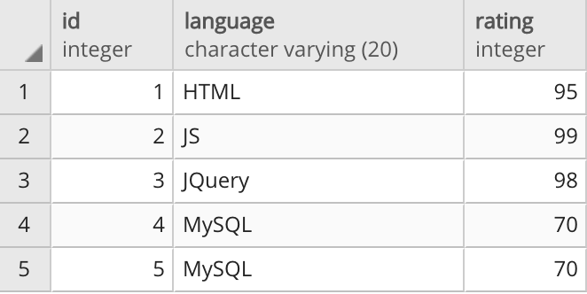

## Making and Using an ID

In this activity, you will recreate a table and then query, insert, and update data.

### Instructions

1. Create a new database named `programming_db`. 

2. Recreate the `programming_languages` table using the following image.

3. Query the table to return the rows containing MySQL, and then delete one of the duplicates.

4. Insert a few more rows of data for additional programming languages by adding the `language` and `rating` of your choice to the `programming_languages` table.

5. Change the name of the JS language to JavaScript.

6. Change the rating for HTML to 90.

### Bonus

* Research how to add columns to a table. Then create a Boolean column named `mastered` that  has a default value of `true`.

* Start looking into the concept of joins in SQL. (This concept will be covered later in the lesson.)
